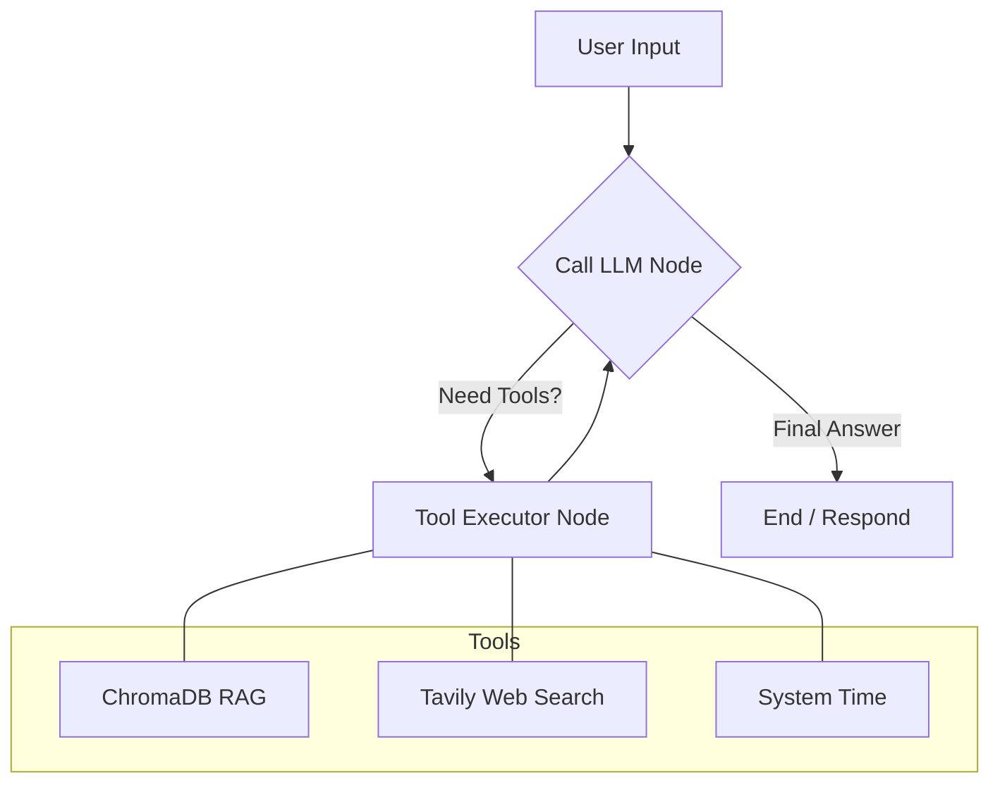
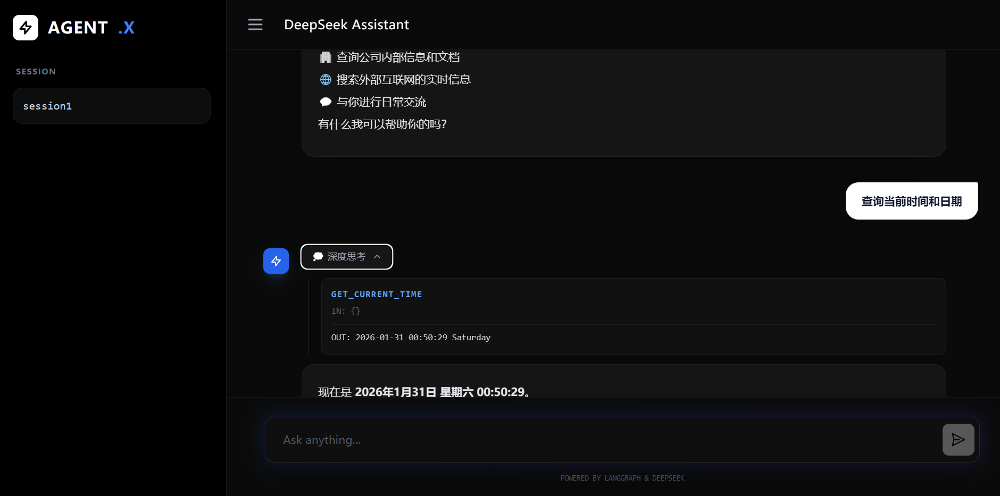
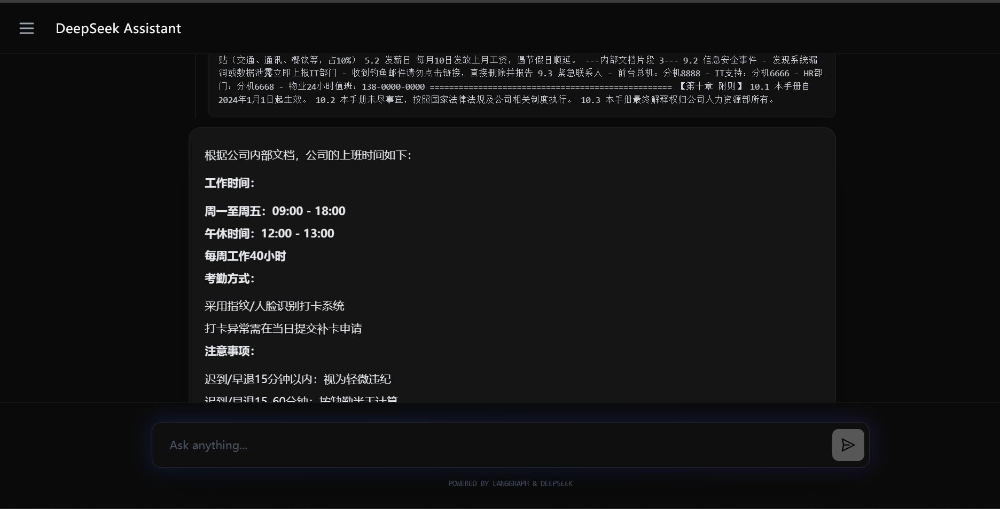
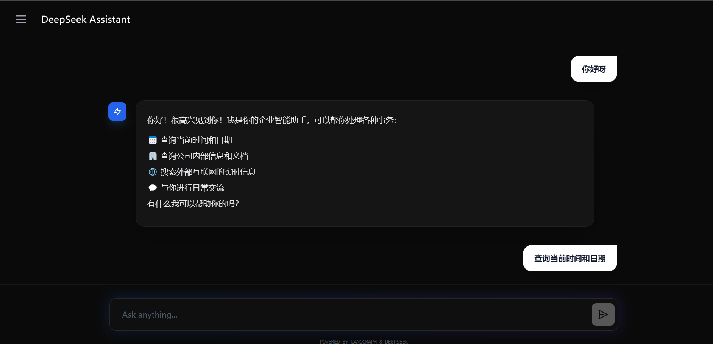
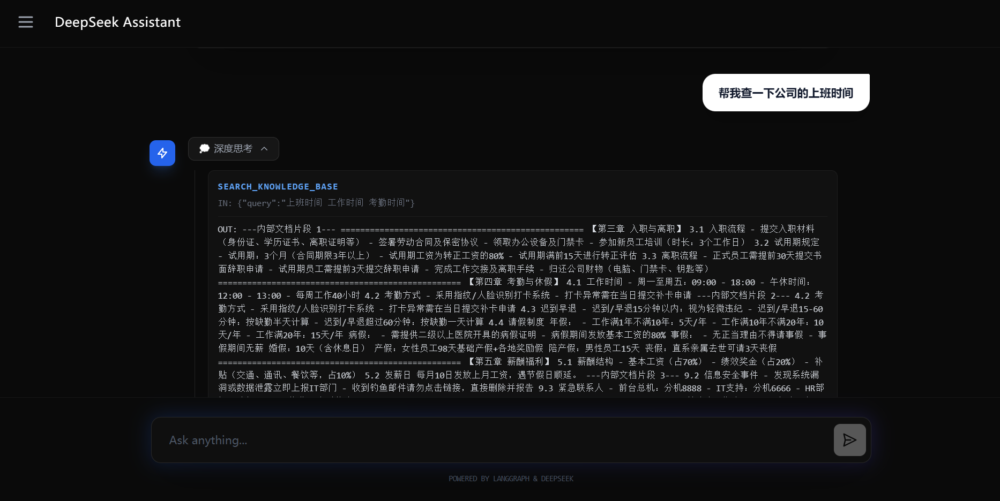
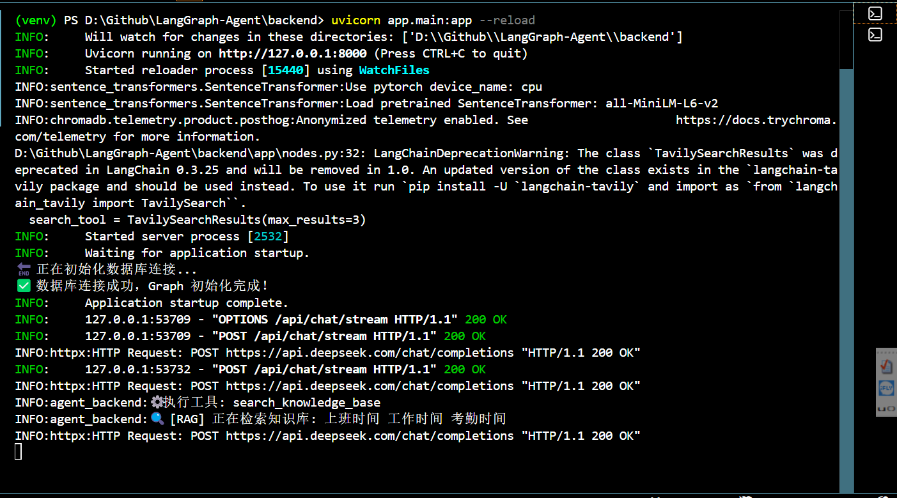

# 智能体开发平台：基于 LangGraph 与 FastAPI 的 RAG 混合驱动 Agent

> **项目定位**：本项目是一个深度集成 **LangGraph 状态机编排**、**FastAPI 异步流式框架**与 **Vue3 响应式前端**的 AI Agent 全栈工程。旨在解决传统线性 LLM 应用无法处理复杂循环逻辑、缺乏长期记忆及工具调用过程不透明的问题。

---

## 🌟 核心亮点

1. **确定性状态机编排 (LangGraph)**：
* 拒绝不可控的 `AutoGPT` 模式，采用 `StateGraph` 定义 Agent 决策边界。
* 实现 **循环（Cycle）逻辑**：当 LLM 发现工具返回结果不足以回答问题时，会自动触发多轮工具调用，直到获取最终答案。


2. **异步持久化与会话隔离**：
* 基于 `AsyncSqliteSaver` 实现高性能异步 Checkpointer。
* 通过 `thread_id` 物理隔离不同用户的对话上下文，支持断点续传式的状态恢复。


3. **多路动态路由工具链**：
* **私有知识 RAG**：集成 ChromaDB 向量库，通过语义检索提取企业内部文档（如员工手册）。
* **实时联网搜索**：集成 Tavily Search API，弥补大模型训练数据的时效性空缺。
* **实时状态感知**：自定义系统时间感知工具，解决模型对“今天”等时效词汇的认知障碍。


4. **工程化流式 UX (SSE)**：
* 前端支持 **“深度思考”过程展示**：实时解析并渲染 Agent 的工具调用参数（Input）与执行结果（Output），实现极致的用户交互透明度。

---

## 🏗️ 架构设计

### 1. 后端逻辑流转图



### 2. 技术栈清单

* **LLM 引擎**: DeepSeek-V3 (兼容 OpenAI API 协议)
* **Agent 框架**: LangGraph (LangChain 生态)
* **后端服务**: FastAPI + Uvicorn (异步高并发)
* **数据库**: ChromaDB (向量库) + SQLite (对话状态持久化)
* **前端**: Vue 3 + Tailwind CSS + Markdown-it (流式渲染)

---

## 📂 项目结构剖析

```text
.
├── backend/
│   ├── app/
│   │   ├── state.py      # 定义 AgentState，利用 operator.add 实现消息增量更新
│   │   ├── graph.py      # 构建有向图拓扑结构，定义条件路由逻辑
│   │   ├── nodes.py      # 核心节点逻辑：包含 RAG 检索、搜索、时间工具定义
│   │   ├── service.py    # 数据库连接池与生命周期管理
│   │   └── main.py       # SSE 异步流式接口，处理 [DONE] 标志位逻辑
│   ├── data/             # 存放企业知识库原始文件
│   └── ingest.py         # RAG 数据入库脚本，支持 PDF/TXT 切分与向量化
├── frontend/             # Vue3 + Vite 构建的极客风 UI
└── docker-compose.yml    # 一键部署前后端及挂载热更新目录

```

---

## 🛠️ 快速部署与测试

### 1. 准备环境

克隆仓库并进入后端目录，配置环境变量：

```bash
# backend/.env
DEEPSEEK_API_KEY=your_key_here
TAVILY_API_KEY=your_key_here

```

### 2. 初始化知识库 (RAG)

将内部文档（如 `knowledge.txt`）放入 `backend/data`，执行：

```bash
pip install -r requirements.txt
python ingest.py
```

### 3. 一键启动 (Docker)

```bash
docker-compose up --build
```

* **前端地址**: `http://localhost:5173`
* **后端接口**: `http://localhost:8000/docs`

---

## 🧠 深度思考

* **消息冗余处理**：在流式输出中，利用 `processed_ids` 集合记录已推送的消息 ID，防止 LangGraph 状态机迭代中重复发送历史消息。
* **优雅停机**：在 FastAPI 的 `shutdown` 事件中显式关闭 `aiosqlite` 连接，防止数据库文件锁死或数据损坏。
* **响应式布局**：前端适配了多种分辨率，并通过 `nextTick` 实现了流式文本生成时的自动滚动触底优化。

---
## 📸 运行效果展示 (Visual Demo)

### 1. 核心对话与 RAG 检索链路
项目实现了基于 DeepSeek 的流式对话，并集成实时企业知识库（RAG）检索。

| 智能助手初始界面 | 知识库检索结果渲染 |
| :---: | :---: |
|  |  |
| *图 1：Agent 能力感知与欢迎语* | *图 2：Markdown 格式化后的检索回复* |

### 2. 深度思考过程透明化 (Tool-Call Transparency)
前端实时解析并展示 Agent 的工具调用逻辑（Tool Calls），支持查看完整的输入参数与检索片段。

| 工具调用详情 (get_current_time) | 知识库原始片段详情 (RAG) |
| :---: | :---: |
|  |  |
| *图 3：实时系统时间获取过程* | *图 4：RAG 检索出的原始文档片段* |

### 3. 异步高并发后端监控
后端基于 FastAPI 异步框架，实现了稳定的流式 SSE 推送与数据库持久化。

<div align="center">
  
  <p><i>图 5：后端 Uvicorn 日志监控与 LLM 交互链路</i></p>
</div>

---
## 👨‍💻 感悟 

在开发本项目过程中，我深刻理解了 Agent 应用中 **状态管理** 的重要性。从最初的线性 Chain 升级到有环图（Graph）结构，使得模型在面对复杂查询时能通过多次自省（Self-correction）获取更精准的结果。同时，针对 **RAG 的 Chunk 大小优化** 和 **SSE 流式传输的稳定性** 做了大量调试，这提升了我处理全栈 AI 应用的综合能力。

